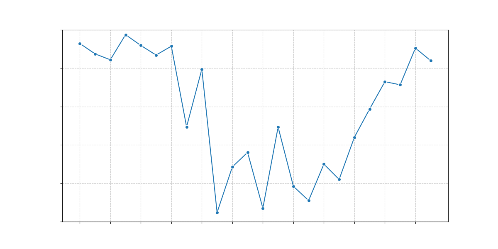

# Arlipark

Arlipark uses [publicly available parking data](https://api.exactpark.com/arlington) to train a model to predict parking availability. The predictions are then presented in a React-based UI where, given the day of the week and time of day, can predict chances of parking availability. The finished project was deployed and presented to the [Hacking Showcase](https://www.arlingtonva.us/Government/Programs/Transportation/Events/Code-the-Curb-A-Parking-Data-Hacking-Showcase) for participants to use.

## Project Structure

```
.
├── .gitignore
├── README.md
├── backend
│   ├── .gitignore
│   ├── Dockerfile
│   ├── figure.png
│   ├── main.py
│   ├── model
│   │   ├── chart.py
│   │   └── train.py
│   ├── parking-fixed.json
│   ├── parking.json
│   ├── requirements.txt
│   ├── routes
│   │   └── predict.py
│   ├── scp-model.sh
│   ├── scp.sh
│   ├── stalls.json
│   ├── train.sh
│   └── util
│       ├── fix.js
│       └── util.js
├── docker-compose.yml
├── frontend
│   ├── .env
│   ├── .gitignore
│   ├── Dockerfile
│   ├── README.md
│   ├── package-lock.json
│   ├── package.json
│   ├── public
│   │   ├── favicon.ico
│   │   ├── index.html
│   │   ├── manifest.json
│   │   ├── map.png
│   │   └── robots.txt
│   └── src
│       ├── App.css
│       ├── App.js
│       ├── App.test.js
│       ├── components
│       │   ├── Chart.js
│       │   ├── DayPicker.js
│       │   ├── LocationPicker.js
│       │   ├── RouteForm.js
│       │   ├── TimePicker.js
│       │   └── ui
│       ├── index.css
│       ├── index.js
│       ├── reportWebVitals.js
│       ├── service
│       │   └── predict.service.js
│       ├── setupTests.js
│       └── util
│           └── theme.js
└── nginx
    ├── frontend.conf
    └── main.conf
```

## Backend

The backend is built using Python and FastAPI. It includes the following components:

- `main.py`: The main entry point for the FastAPI application.
- `routes/predict.py`: The API endpoint for predicting parking availability.
- `model/train.py`: The script for training the machine learning model.
- `model/chart.py`: The script for generating charts based on the model predictions.
- `util/fix.js` and `util/util.js`: Utility scripts for processing parking data.

### Training the Model

To train the model ensure scraped data is included in `./backend/parking-fixed.json` and run the following commands:

```sh
cd backend && source ./.venv/bin/activate
./train.sh
```

### Generating Charts

To visualize the model:

```sh
cd backend && source ./.venv/bin/activate
python ./model/chart.py
```

Example:



## Frontend
The frontend is built using React and Material-UI. It includes the following components:

- `src/components/LocationPicker.js`: A component for selecting a location on the map.
- `src/components/TimePicker.js`: A component for selecting a time.
- `src/components/DayPicker.js`: A component for selecting a day of the week.
- `src/components/RouteForm.js`: A form for submitting the route details and getting predictions.
- `src/components/Chart.js`: A component for displaying the prediction results in a chart.

## Running the Full Project

Add the `REACT_APP_BACKEND_URL` in the `./backend/.env` file.

Using docker compose:

```sh
docker compose up
```
